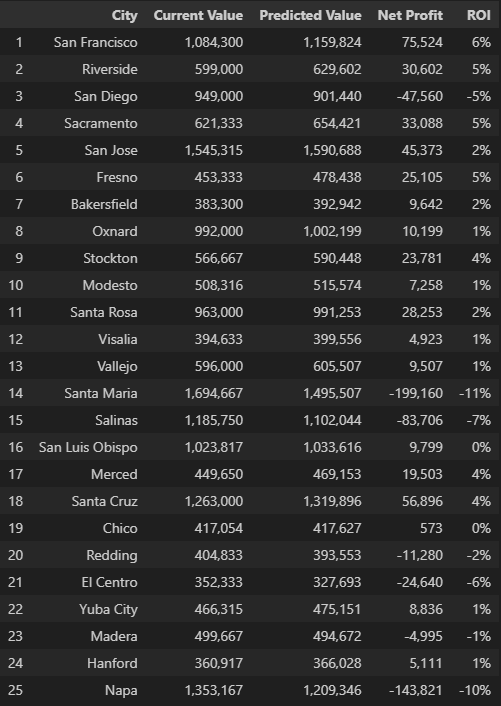
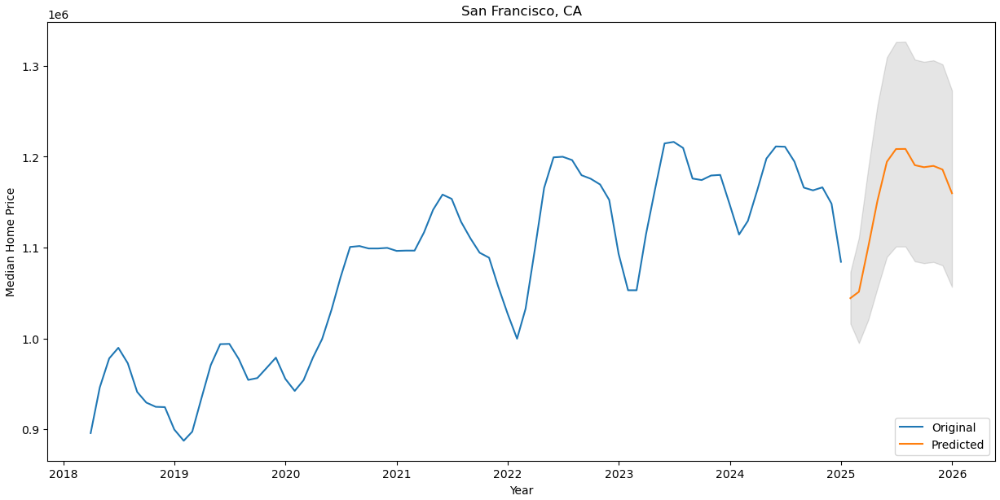
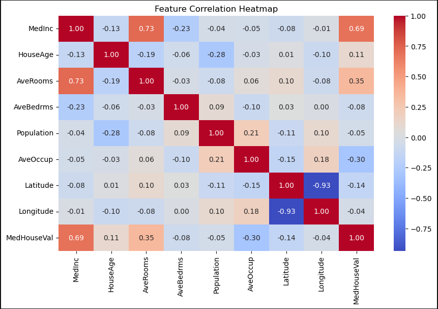
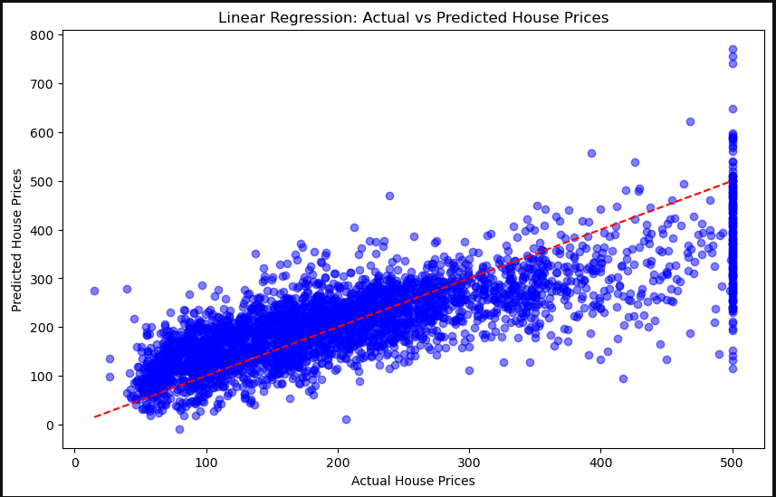

# **Golden State Housing Report: A predictive analysis of California's housing market**
<a id="idtop"></a>  


## Table of Contents
* [Project Overview](#overview)
* [Business Scenario](#business-scenario)
* [Data PreProcessing](#data-preprocessing)
* [Model Training and Testing](#model-training-and-testing)
* [Visuals and Explanations](#visuals-and-explanations)
* [Demos and Slideshow](#demos-and-slideshow)
* [Additional Explanations and Major Findings](#additional-explanations-and-major-findings)
* [Recommendations and Conclusion](#recommendations-and-conclusion)
* [Project Contributors](#project-contributors) 
* [Project Structure](#project-structure)
* [Repository Links](#repository-links)

## Project Overview 
The primary goal of our project, Golden State Housing Insights, is to predict housing prices in the state of California. Our team aims to achieve this by leveraging machine learning models to analyze various factors, including investor return on investment (ROI), feature analysis and interest rate predictability. By integrating these elements, we strive to provide accurate and actionable insights into the California housing market, aiding investors, homebuyers, and policymakers in making informed decisions.
[🔼 Back to top](#idtop)<hr>

## Business Scenario
We framed our business problem by taking the role of an independent real estate consultant. Our client is looking to purchase a home in California after recently accepting a job offer in the area. Therefore, they have approached us to identify metro areas that have the highest return on investment. Our task is to identify the best 5 metro areas which we believe will have the highest ROI based on a home feature analysis  as well as predict interest rates in the near term. These predictions will be made using Time Series modeling and linear regression. 
[🔼 Back to top](#idtop)<hr>

## Data PreProcessing
* Housing Price Prediction using Zillow Data Analysis
  * Our team employed a comprehensive data pre-processing approach to ensure the accuracy and reliability of our housing price predictions. We utilized powerful libraries such as NumPy and Pandas for efficient data manipulation and analysis. Matplotlib was used for visualizing data trends and patterns. We also applied data melting techniques to reshape our datasets, making them more suitable for analysis. Additionally, we incorporated time series analysis to account for temporal trends and seasonality in housing prices. This robust pre-processing framework enabled us to prepare our data effectively for machine learning modeling. Our team conducted an extensive exploratory data analysis (EDA) to uncover underlying patterns and relationships within the housing data. This initial step allowed us to gain valuable insights and informed our subsequent modeling approach. 
* Housing Feature Analysis
  * To prepare the dataset for analysis, we first removed outliers by filtering extreme values in the features AveRooms, AveBedrms, Population, and AveOccup. Next, we use a Heat Map to determine the most impactful variables for predicting house prices in the dataset. The data was then split into training and testing sets, with 80% allocated for training and 20% for testing using the train_test_split() function. Finally, we standardized the values using StandardScaler() to ensure consistent scaling across features. We employed a Linear Regression model for our analysis. The models were trained using the model.fit(X_train, y_train) method, which allowed them to learn from the training data. Once trained, we made predictions on the test data using the model.predict(X_test) function. This approach enabled us to evaluate the performance and accuracy of the model.
  * To predict housing market trends and analyze influential home features, we utilized the Ames dataset, assuming Californians have similar preferences. We began by preprocessing the dataset, removing features with sparse data and encoding non-numerical features. A correlation analysis was then conducted to identify the 12-15 most influential home features based on their correlation with home prices. 
* Interest Rate Prediction Analysis
  * To predict future interest rates up to February 2025, the code utilizes historical data from a CSV file ('fed-rates.csv'). The data spans from January 2017 to December 2024, and is cleaned to calculate average monthly rates. The machine learning techniques employed involve using the trained models to predict interest rates for the months leading up to February 2025. 
[🔼 Back to top](#idtop)<hr>

## Model Training and Testing  
* Housing Price Prediction using Zillow Data Analysis
  * We employed both ARIMA (AutoRegressive Integrated Moving Average) and Auto-ARIMA models to predict housing prices. The ARIMA model helped us understand the temporal dependencies and trends in the data, while the Auto-ARIMA model automated the process of identifying the optimal parameters for our time series forecasting. By comparing the results from these models, we were able to enhance the accuracy and robustness of our housing price predictions.
* Housing Feature Analysis
  * We employed a Linear Regression model for our analysis. The models were trained using the model.fit(X_train, y_train) method, which allowed them to learn from the training data. Once trained, we made predictions on the test data using the model.predict(X_test) function. This approach enabled us to evaluate the performance and accuracy of the model. 
  * We trained models using Linear Regression and Random Forest, employing recursive feature elimination to iteratively remove less important features. Model performance was evaluated using RMSE, R², and MAE metrics, providing a comprehensive understanding of the factors influencing home prices.
* Interest Rate Prediction Analysis
  * The visualization includes three key elements: the actual historical interest rates, represented as a line with circle markers; the Linear Regression predictions, depicted as a dashed line with 'x' markers, which illustrate the general trend but may miss some finer details; and the K-Nearest Neighbors (KNN) predictions, shown as a dotted line with square markers, which are potentially more responsive to recent changes in interest rates.
[🔼 Back to top](#idtop)<hr>

## Visuals and Explanations
* We used various visualizations to depict our data, including line graphs for trends, bar charts for categorical comparisons, scatter plots for correlations, and heatmaps for data density and relationships. These visualizations were presented in Google Slides for easy sharing and in Streamlit for an interactive experience, effectively communicating our findings.

**Housing Price ROI**

The ROI for California top metro areas.

**Housing Price Prediction**

The home value predictions for California top metro areas.

**Housing Price Prediction Top Metro**

The home value predictions for California top metro.

**Housing Feature Analysis chart 1**

Feature analysis 1.

**Housing Feature Analysis chart 2**

Feature analysis 2.

**Interest Rate Prediction Analysis chart 1**

linear Regression 1.

**Interest Rate Prediction Analysis chart 2**

linear Regression 2.
[🔼 Back to top](#idtop)<hr>

## Demos and Slideshow
* Housing Price Prediction using Zillow Data Analysis 
  * Navigate to [Demo](resources/content/cg_demo.gif)    
* Housing Feature Analysis
  * Navigate to [Demo](resources/content/mn_demo.gif)
* Interest Rate Prediction Analysis
  * Navigate to [Demo](resources/content/dex_demo.gif)  
* Project #2 - Team #6 - Slideshow 
  * Navigate to [Slideshow PDF](Resources/content/proj1slideshow.pdf)
[🔼 Back to top](#idtop)<hr>

## Additional Explanations and Major Findings
  * Major findings
    * Housing Price Prediction using Zillow Data Analysis
    * Housing Feature Analysis  
    * Interest Rate Prediction Analysis
[🔼 Back to top](#idtop)<hr>

## Recommendations and Conclusion
[🔼 Back to top](#idtop)<hr>

## Project Contributors
- Chris Gilbert <br>
    Github: [www.github.com/xraySMULu](https://github.com/xraySMULu)<br>
- Dexter Johnson <br>
    Github: [www.github.com/deondrae4088](https://github.com/deondrae4088)<br>
- Jacinto Quiroz <br>
    Github: [www.github.com/xraySMULu](https://github.com/xraySMULu)<br>
- Joel Freeman <br>
    Github: [www.github.com/xraySMULu](https://github.com/xraySMULu)<br>
- Sean Burroughs <br>
    Github: [www.github.com/xraySMULu](https://github.com/xraySMULu)<br>
- Will Atwater <br>
    Github: [www.github.com/xraySMULu](https://github.com/xraySMULu)<br>
[🔼 Back to top](#idtop)<hr>

## Project Structure
```
├─ code
├─── cg_eda_arima.ipynb
├─── dex_pred_analysis.ipynb
├─── rb_pred_features.ipynb
├─── will_pred_features.ipynb
├─ resources
├── data
├─── fed-rates.csv
├─── metro_zillow.csv
├─── Zillow_historical_pricing.csv
├─── rb_dataset.csv
├─── will_dataset.csv
├── content
├─── cd_mtop.png
├─── cg_demo.gif
├─── cg_predictions.png
├─── cg_roi.png
├─── dex_demo.gif
├─── dex_lr1.png
├─── dex_lr2.png
├─── gs1.jpg
├─── rb_heat.png
├─── rb_linearreg.png
├─ README.md
```
[🔼 Back to top](#idtop)<hr>

## Repository Links
* Code: Code - Directory containing all of the the code
  * Housing Price Prediction using Zillow Data Analysis
    * Navigate to [Link to Housing Price Prediction using Zillow Data Analysis](code/cg_eda_arima.ipynb)    
  * Housing Feature Analysis 
    * Navigate to [Link to Housing Feature Analysis](code/rb_pred_features.ipynb)
    * Navigate to [Link to Housing trim Analysis](code/will_pred_features.ipynb)
  * Interest Rate Prediction Analysis
    * Navigate to [Link to Interest Rate Prediction Analysis](code/dex_pred_analysis.ipynb)  
* Content: 
  * Navigate to [resources/content](resources/content) - Directory containing all images of plots created in Jupyter Notebook and demos.
* Data: 
  * Navigate to [resources/data](resources/data) - Directory containing all of the csv files used by the code
[🔼 Back to top](#idtop)<hr>

## References
